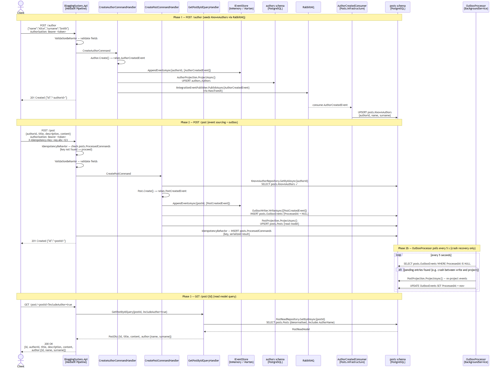

# Yuki Blogging System

A RESTful blogging API built with **.NET 8** using a **Modular Monolith** architecture with a clear path to microservices extraction. Implements Hexagonal Architecture, CQRS, Event Sourcing, and the Outbox pattern.

---

## Architecture Overview

```
┌─────────────────────────────────────────────────────────────┐
│  BloggingSystem.Api  (monolith host, port 5002 / 8080)      │
│  Posts.Api           (standalone, port 8082)                │
│  Authors.Api         (standalone, port 8083)                │
│  Gateway             (YARP reverse proxy, port 8081)        │
└─────────────────────┬────────────────────┬──────────────────┘
                      │ MediatR            │ MassTransit
          ┌───────────▼──────┐   ┌─────────▼──────────┐
          │  Posts module     │   │  Authors module     │
          │  Posts.Domain     │   │  Authors.Domain     │
          │  Posts.Application│   │  Authors.Application│
          │  Posts.Infrastructure  Authors.Infrastructure│
          └───────────────────┘   └────────────────────┘
                      │                    │
          ┌───────────▼────────────────────▼──────────┐
          │  Shared.*  (Domain / Application / Infra)  │
          │  IEventStore · IOutboxWriter · Behaviors   │
          └────────────────────────────────────────────┘
```

### Role of `BloggingSystem.Api`

`BloggingSystem.Api` is the **monolith host** — it wires both modules into a single process. It exists for three reasons:

| Reason | Detail |
|---|---|
| **Test suite** | All 48 functional tests run against it via `WebApplicationFactory`. Both modules load together, so the full `POST /author → RabbitMQ → AuthorCreatedConsumer → POST /post` chain can be tested without Docker. |
| **Monolith deployment** | A single deployable binary for teams not yet ready to operate multiple services. Same codebase, zero behaviour change — graduate to standalone APIs when ready. |
| **Retirement path** | Once `Posts.Api` and `Authors.Api` have their own functional test suites, this host becomes redundant and can be deleted. That is the natural end state of the microservices migration. |

### Key patterns

| Pattern | Implementation |
|---|---|
| **CQRS** | Write side via `IEventStore`; read side via EF Core projections |
| **Event Sourcing** | `Post.Create()` → `PostCreatedEvent` → append → project |
| **Outbox** | `OutboxEvents` table + `OutboxProcessor` BackgroundService — survives crashes |
| **Hexagonal** | Domain/Application never reference Infrastructure or API |
| **Strategy (Serialization)** | `json` ↔ `xml` via `Serialization:Format` config — zero code change |
| **Strategy (Event Store)** | `inmemory` ↔ `marten` via `EventStore:Provider` config |
| **Strategy (Message Bus)** | `inmemory` ↔ `rabbitmq` via `MessageBus:Transport` config |
| **Idempotency** | `X-Idempotency-Key` header + `ProcessedCommands` table per module |
| **Cross-module events** | `AuthorCreatedEvent` published via MassTransit; `AuthorCreatedConsumer` populates `KnownAuthors` table in Posts module |

---

## Use Case: Create Post — End-to-End Flow

The diagram below shows the full journey across three phases: author creation (which seeds the cross-module `KnownAuthors` cache via RabbitMQ), post creation (event sourcing + outbox), and querying a post (read model).



> Source: [`docs/create-post-flow.mmd`](docs/create-post-flow.mmd)

### Key observations

| # | What to notice |
|---|---|
| 1 | **No direct module call** — Posts never queries the Authors database. It reads its own `KnownAuthors` cache, populated asynchronously by `AuthorCreatedConsumer`. |
| 2 | **Outbox decouples write from projection** — `PostCreatedEvent` is persisted to `OutboxEvents` before the in-process projection runs. If the process crashes between those two steps, `OutboxProcessor` replays the event on restart. |
| 3 | **Idempotency is transparent** — a duplicate `POST /post` with the same `X-Idempotency-Key` returns the cached `201` without re-executing the handler. |
| 4 | **Read path is cheap** — `GET /post/{id}` hits only the denormalised `posts.Posts` table; no join to the Authors schema is needed even when `includeAuthor=true`. |
| 5 | **RabbitMQ is optional** — swap `MessageBus:Transport` to `inmemory` and MassTransit delivers the event in-process; zero infrastructure changes needed for local dev or tests. |

---

## Project Structure

```
src/
  Modules/
    Posts/
      Posts.Domain/          # Post aggregate, PostId, PostCreatedEvent
      Posts.Application/     # CreatePostCommand, GetPostsQuery, projections
      Posts.Infrastructure/  # PostsDbContext (schema: posts), outbox, consumer
      Posts.Api/             # Standalone API host — port 8082
    Authors/
      Authors.Contracts/     # AuthorId, AuthorCreatedEvent (cross-module contract)
      Authors.Domain/        # Author aggregate
      Authors.Application/   # CreateAuthorCommand, projections
      Authors.Infrastructure/# AuthorsDbContext (schema: authors), seeder
      Authors.Api/           # Standalone API host — port 8083
  Shared/
    Shared.Domain/           # IDomainEvent, DomainException
    Shared.Application/      # Ports, MediatR behaviors, PagedResult<T>
    Shared.Infrastructure/   # InMemoryEventStore, MartenEventStore, MassTransit wiring
  Gateway/                   # YARP reverse proxy — port 8081
  BloggingSystem.Api/        # Monolith host (both modules) — port 5002 / 8080

tests/
  BloggingSystem.Domain.Tests/         # 26 pure unit tests
  BloggingSystem.Application.Tests/    # 50 unit tests (NSubstitute mocks)
  BloggingSystem.Infrastructure.Tests/ # 47 integration tests
  BloggingSystem.Api.Tests/            # 48 functional tests (WebApplicationFactory)
  BloggingSystem.Architecture.Tests/   # 24 architecture boundary assertions
```

---

## Prerequisites

| Tool | Version | Required for |
|---|---|---|
| [.NET 8 SDK](https://dotnet.microsoft.com/download/dotnet/8) | 8.x | All run / test paths |
| [Docker Desktop](https://www.docker.com/products/docker-desktop/) | any | `docker compose` path |
| PostgreSQL | 15+ | Only when `EventStore:Provider=marten` or `ReadModel:Provider=postgresql` |

> All tests and the default `dotnet run` path use **in-memory** stores — no external services required.

---

## Quick Start (in-memory, no Docker)

```bash
# 1. Clone
git clone <repo-url>
cd Yuki

# 2. Restore & build
dotnet restore
dotnet build

# 3. Run the monolith host
dotnet run --project src/BloggingSystem.Api
```

Swagger UI: [http://localhost:5002/swagger](http://localhost:5002/swagger)

**Get a token first** (all write endpoints require JWT):

```bash
curl -X POST http://localhost:5002/auth/token \
  -H "Content-Type: application/json" \
  -d '{"username":"admin","password":"admin123"}'
```

Use the returned `token` value as `Bearer <token>` in the `Authorization` header.

---

## Running with Docker Compose (full stack)

Starts PostgreSQL, RabbitMQ, Jaeger, the monolith API, the two standalone module APIs, and the YARP gateway.

```bash
docker compose up --build
```

| Service | URL | Description |
|---|---|---|
| Monolith API | [http://localhost:8080/swagger](http://localhost:8080/swagger) | All endpoints, both modules |
| Posts API | [http://localhost:8082/swagger](http://localhost:8082/swagger) | Posts module only |
| Authors API | [http://localhost:8083/swagger](http://localhost:8083/swagger) | Authors module only |
| Gateway (YARP) | http://localhost:8081 | Routes `/post*` → Posts API, `/author*` → Authors API |
| RabbitMQ UI | [http://localhost:15672](http://localhost:15672) | guest / guest |
| Jaeger UI | [http://localhost:16686](http://localhost:16686) | Distributed traces |
| PostgreSQL | localhost:5433 | blogging / postgres / postgres |

To run only the infrastructure services (so you can still `dotnet run` locally against real Postgres and RabbitMQ):

```bash
docker compose up postgres rabbitmq jaeger
```

Then run the API with the Development profile (which points at those containers):

```bash
dotnet run --project src/BloggingSystem.Api
```

---

## Running the Standalone Module APIs

Each module API can be started independently:

```bash
# Posts API on port 8082
dotnet run --project src/Modules/Posts/Posts.Api

# Authors API on port 8083
dotnet run --project src/Modules/Authors/Authors.Api

# YARP gateway on port 8081 (routes to the two above)
dotnet run --project src/Gateway
```

---

## Running Tests

All tests use in-memory infrastructure — no external services required.

```bash
dotnet test
```

With code coverage:

```bash
dotnet test --collect:"XPlat Code Coverage"
```

Generate an HTML report:

```bash
dotnet tool install -g dotnet-reportgenerator-globaltool
reportgenerator \
  -reports:"tests/**/TestResults/**/coverage.cobertura.xml" \
  -targetdir:coveragereport \
  -reporttypes:Html
# open coveragereport/index.html
```

---

## Authentication

All write endpoints (`POST /post`, `POST /author`) require a **JWT Bearer token**.

**Get a token:**

```bash
curl -X POST http://localhost:5002/auth/token \
  -H "Content-Type: application/json" \
  -d '{"username":"admin","password":"admin123"}'
```

Built-in demo accounts:

| Username | Password |
|---|---|
| `admin` | `admin123` |
| `author` | `author123` |

Use the token in subsequent requests:

```bash
curl -X POST http://localhost:5002/post \
  -H "Authorization: Bearer <token>" \
  -H "Content-Type: application/json" \
  -d '{"authorId":"11111111-1111-1111-1111-111111111111","title":"Hello","description":"...","content":"..."}'
```

---

## Idempotency

Write endpoints support idempotent retries. Send the same `X-Idempotency-Key` header and the second call returns the cached response without re-executing the command:

```bash
curl -X POST http://localhost:5002/post \
  -H "Authorization: Bearer <token>" \
  -H "X-Idempotency-Key: my-unique-request-id-123" \
  -H "Content-Type: application/json" \
  -d '{"authorId":"11111111-1111-1111-1111-111111111111","title":"Hello","description":"...","content":"..."}'
```

---

## Seeded Authors

Two authors are created automatically on startup:

| Name | ID |
|---|---|
| Jane Doe | `11111111-1111-1111-1111-111111111111` |
| John Smith | `22222222-2222-2222-2222-222222222222` |

---

## Configuration Reference

All switches live in `appsettings.json` (environment overrides in `appsettings.{Environment}.json`).

| Key | Values | Default | Notes |
|---|---|---|---|
| `Serialization:Format` | `json`, `xml` | `json` | Switches `IMessageSerializer` |
| `EventStore:Provider` | `inmemory`, `marten` | `inmemory` | `marten` requires PostgreSQL |
| `ReadModel:Provider` | `inmemory`, `postgresql` | `inmemory` | `postgresql` runs EF migrations on startup |
| `MessageBus:Transport` | `inmemory`, `rabbitmq` | `inmemory` | `rabbitmq` requires a running broker |
| `MessageBus:RabbitMQ:Host` | hostname | `localhost` | Used when transport is `rabbitmq` |
| `MessageBus:RabbitMQ:Username` | string | `guest` | |
| `MessageBus:RabbitMQ:Password` | string | `guest` | |
| `ConnectionStrings:PostgreSQL` | Npgsql string | *(none)* | Required for `marten` or `postgresql` providers |
| `OpenTelemetry:OtlpEndpoint` | OTLP URL | *(none)* | When set, enables tracing export (e.g. `http://localhost:4317`) |
| `Jwt:Issuer` | string | `blogging-api` | JWT token issuer |
| `Jwt:Audience` | string | `blogging-clients` | JWT token audience |
| `Jwt:SecretKey` | string | *(dev key)* | Minimum 32 chars. **Change before production.** |
| `Jwt:ExpiryMinutes` | integer | `60` | Token lifetime |

**Full PostgreSQL + RabbitMQ stack:**

```json
{
  "Serialization": { "Format": "json" },
  "EventStore": { "Provider": "marten" },
  "ReadModel": { "Provider": "postgresql" },
  "MessageBus": {
    "Transport": "rabbitmq",
    "RabbitMQ": { "Host": "localhost", "Username": "guest", "Password": "guest" }
  },
  "ConnectionStrings": {
    "PostgreSQL": "Host=localhost;Port=5433;Database=blogging;Username=postgres;Password=postgres"
  }
}
```

---

## API Reference

### POST /auth/token

Issues a JWT for use with protected endpoints.

```json
{ "username": "admin", "password": "admin123" }
```

| Status | Description |
|---|---|
| 200 | `{ "token": "...", "expiresAt": "..." }` |
| 401 | Invalid credentials |

---

### POST /author  *(requires Bearer token)*

```json
{ "name": "Alice", "surname": "Smith" }
```

| Status | Description |
|---|---|
| 201 | `{ "id": "<guid>" }` · `Location: /author/<id>` |
| 400 | Validation error |
| 401 | Missing / invalid token |

---

### POST /post  *(requires Bearer token)*

```json
{
  "authorId": "11111111-1111-1111-1111-111111111111",
  "title": "My First Post",
  "description": "A short summary",
  "content": "The full body."
}
```

| Status | Description |
|---|---|
| 201 | `{ "id": "<guid>" }` · `Location: /post/<id>` |
| 400 | Validation error |
| 401 | Missing / invalid token |
| 404 | Author not found |

---

### GET /post

Returns a paginated list of posts ordered by creation date.

| Parameter | Type | Default | Description |
|---|---|---|---|
| `page` | integer | `1` | 1-indexed page number |
| `pageSize` | integer | `10` | Items per page |
| `includeAuthor` | boolean | `false` | Embed author details |

```json
{
  "items": [
    {
      "id": "a3f1...",
      "authorId": "11111111-...",
      "title": "My Post",
      "description": "Short summary",
      "content": "Full body.",
      "author": null
    }
  ],
  "totalCount": 42,
  "page": 1,
  "pageSize": 10,
  "totalPages": 5
}
```

---

### GET /post/{id}

| Parameter | Type | Default | Description |
|---|---|---|---|
| `includeAuthor` | boolean | `false` | Embed author details |

| Status | Description |
|---|---|
| 200 | Post object |
| 400 | Invalid GUID format |
| 404 | Post not found |

---

## Sample cURL Requests

```bash
BASE=http://localhost:5002

# 1. Get a token
TOKEN=$(curl -s -X POST $BASE/auth/token \
  -H "Content-Type: application/json" \
  -d '{"username":"admin","password":"admin123"}' | \
  grep -o '"token":"[^"]*"' | cut -d'"' -f4)

# 2. Create a post
curl -X POST $BASE/post \
  -H "Authorization: Bearer $TOKEN" \
  -H "Content-Type: application/json" \
  -d '{
    "authorId": "11111111-1111-1111-1111-111111111111",
    "title": "Hello World",
    "description": "My first post",
    "content": "This is the body."
  }'

# 3. List posts
curl "$BASE/post?page=1&pageSize=5&includeAuthor=true"

# 4. Get a single post
curl "$BASE/post/<POST_ID>?includeAuthor=true"

# 5. Create an author
curl -X POST $BASE/author \
  -H "Authorization: Bearer $TOKEN" \
  -H "Content-Type: application/json" \
  -d '{"name":"Alice","surname":"Smith"}'
```

---

## Inspecting the Database

Each module owns its own PostgreSQL schema. When connecting via `psql`, the default search path is `public`, so unqualified table names will not resolve. Always prefix with the schema name.

```bash
docker exec -it yuki-postgres-1 psql -U postgres -d blogging
```

### Schema layout

| Schema | Owner | Tables |
|---|---|---|
| `authors` | Authors module | `Authors`, `ProcessedCommands` |
| `posts` | Posts module | `Posts`, `KnownAuthors`, `OutboxEvents`, `ProcessedCommands` |
| `public` | Marten (event store) | `mt_events`, `mt_streams` |

### Useful queries

```sql
-- Authors read model (EF Core projection)
SELECT * FROM authors."Authors";

-- Posts read model (EF Core projection)
SELECT * FROM posts."Posts";

-- KnownAuthors — Posts module local cache, populated via RabbitMQ consumer
SELECT * FROM posts."KnownAuthors";

-- Outbox — pending entries have ProcessedAt = NULL
SELECT * FROM posts."OutboxEvents";

-- Event store — full event log (all modules, Marten)
SELECT stream_id, type, version FROM public.mt_streams;
SELECT seq_id, stream_id, type, data FROM public.mt_events ORDER BY seq_id;
```

You can also set the search path for the session to avoid qualifying every table:

```sql
SET search_path TO authors, posts, public;
SELECT * FROM "Authors";
SELECT * FROM "Posts";
```

> **Why separate schemas?** Schema isolation is what allows the two modules to be extracted into independent services later — each service would simply point its connection string at its own database instance without changing a single line of application code.

---

## Health Checks

Each API host exposes:

| Endpoint | Purpose |
|---|---|
| `GET /healthz/live` | Liveness — always 200 if the process is running |
| `GET /healthz/ready` | Readiness — 200 when PostgreSQL is reachable (healthy tag) |

---

## Microservices Migration

See [MICROSERVICES_MIGRATION.md](MICROSERVICES_MIGRATION.md) for the full step-by-step roadmap from modular monolith to independently deployable services. Current status:

| Step | Status |
|---|---|
| 1 — Message broker (RabbitMQ via MassTransit) | ✅ Done |
| 2 — Schema isolation (separate DbContexts) | ✅ Done |
| 3 — NuGet packaging for shared contracts | ✅ Done (packaging metadata added) |
| 4 — Separate deployables (Posts.Api / Authors.Api) | ✅ Done |
| 5 — API gateway (YARP) | ✅ Done |
| 6 — Distributed infrastructure (tracing, retry, idempotency, graceful shutdown) | ✅ Done |
